<h3><code>$ cat contributions.log</code></h3>

  

<h3><code>$ whoami --verbose</code></h3>

<table>
<tr>

<td valign="middle">

</td>

<td valign="middle">

</td>

</tr>
</table>

 

<code>krish@github:~$ echo "keep building."</code>

